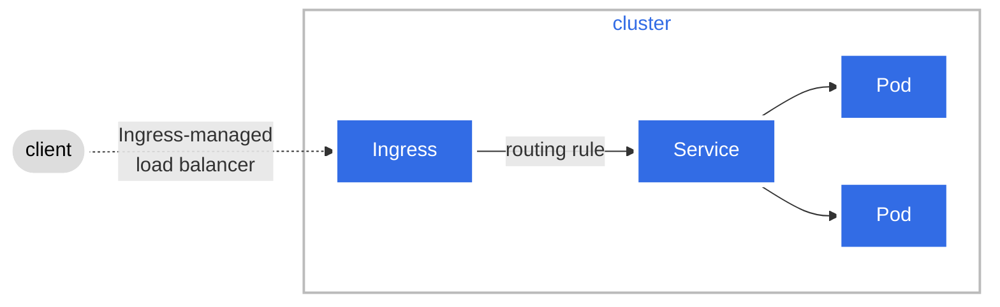

- Kubernetes does not come with Ingress support by default
- Service such as Nginx Ingress, HAProxy and Traefik can be used within Kubernetes and these are called Ingress Controllers.
	- Configuration for these Ingress Controllers are called Ingress Resources.
- Ingress is similar to a reverse proxy. But with additional features build-into it.
- Ingress is a `namespaced` resourece.
# Ingress Controllers
- An extensive [list](https://kubernetes.io/docs/concepts/services-networking/ingress-controllers/#additional-controllers) of different types of Ingress Controllers. ^additional-controllers
## Ingress Class
- Ingresses can be implemented by different controllers. [[#^additional-controllers]]
	- In order to specify which controller is being used `IngressClass` object can be created.
	- This can then be specified in `ingress.spec.ingressClassName`, to specify which Ingress Controller is being used by `Ingress` object.
- `IngressClass` can be scoped to Cluster or Namespace. By default its scoped to Cluster.
- [More information](https://kubernetes.io/docs/concepts/services-networking/ingress/#ingress-class) regarding Ingress Class.
- `ingressClassName` needs to be specified. [Only time it is not necessary is when a default ingress class has been specified by adding `ingressclass.kubernetes.io/is-default-class` as annotation](https://kubernetes.io/docs/concepts/services-networking/ingress/#default-ingress-class).
- Ingress Class is a cluster scoped resource.
## Requirement for a Nginx Ingress
- Deployment - Deployment hosting the Nginx Ingress controller.
	- Nginx Ingress controller container image.
	- Correct arguments
	- A reference to Nginx configuration's ConfigMap
	- Ports exposed
	- Environment variables defined used by the arguments.
- ConfigMap - To store the configurations.
- Service - Required to expose the service.
	- Port mapping
	- Setting `selector`
- Authentication, which requires multiple Kubernetes components.
	- Service Account
	- Roles
	- ClusterRoles
	- RoleBindings
# Ingress Resources
- These are configurations for the Ingress Controllers, in our case Nginx Ingress Controllers.
	- This can be used to do path based routing or sub domain routing.
- Ingress definition files specify rules which assist in configuring Path based routing or sub domain routing to the backend Pod's service.
## Traffic flow
- The traffic from the client first enters the Ingress managed load balancer
```bash
╰─ k get -n ingress-nginx services ingress-nginx-controller
NAME                       TYPE           CLUSTER-IP     EXTERNAL-IP   PORT(S)                      AGE
ingress-nginx-controller   LoadBalancer   10.233.20.66   11.1.0.21     80:30288/TCP,443:31253/TCP   90d
```
- Then traffic enters Nginx controller which sends the traffic to the Ingress,
- Then Ingress's routing rules take effect and direct it to services which then send the traffic to Pods.

## NGINX Ingress
### Rewrite
- [Documentation](https://kubernetes.github.io/ingress-nginx/examples/rewrite/)
- [Lecture](https://www.udemy.com/course/certified-kubernetes-application-developer/learn/lecture/16716434#overview)

> Note: [Regarding MetalLB and Nginx-Ingress](https://www.reddit.com/r/kubernetes/comments/rkuxlp/comment/hpbxlfg/?utm_source=share&utm_medium=web3x&utm_name=web3xcss&utm_term=1&utm_content=share_button).