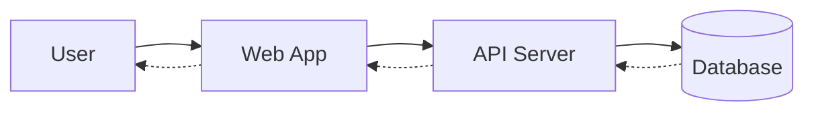
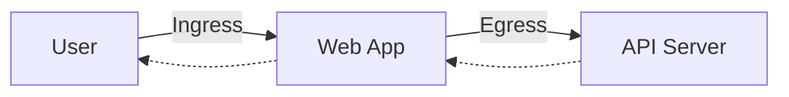

# Ingress Traffic
- Incoming traffic is known as Ingress traffic. For example, traffic coming from a user to an application.
# Egress Traffic
- Outgoing request is known as Egress traffic. For example, traffic outing from an application to the API server.
	- The sender of the traffic 
- An example of a network diagram and the flow of network. Here the lines and dotted lines represent traffic and its directions.

- If we narrow down on this diagram. For "Web App" the Ingress traffic is the one coming in from the Users. And Egress is the one it sends to the API Server. 
> Note: **Replies are not counted as Egress, as they are replies to Ingress.**

# Network Security
- By default Kubernetes network configuration has "Allow All" rule set allowing all Pods and services to communicate with each other directly within the Virtual Private Network.
	- This applies both to Ingress and Egress.****
	- If when creating a policy only `ingress` **is** specified as the `policyTypes`. The reply for the `ingress` requests is implicitly allowed. But because `policyTypes` is set to `ingress` only `ingress` traffic is allowed. Any `egress` requests (not replies to `ingress` requests) originating from sender is denied.
- Network Policies can be implemented to fine-**tune** and set Ingress and Egress policies to one or more Pods.
- Selectors and labels are use to specify which Pod the policy should apply to.
> Note: NetworkPolicies are `namespaced` resources. Therefore, if a network policy is created in a namespace and `spec.podSelector` is blank, then it applies to the whole namespace.

> Note: [If I understand correctly, then this assumption is wrong - NetworkPolicy does not care about intermediate services. For egress, you should always target the pod's containerPort and not the Service port.](https://github.com/projectcalico/calico/issues/8049#issuecomment-1738200278)